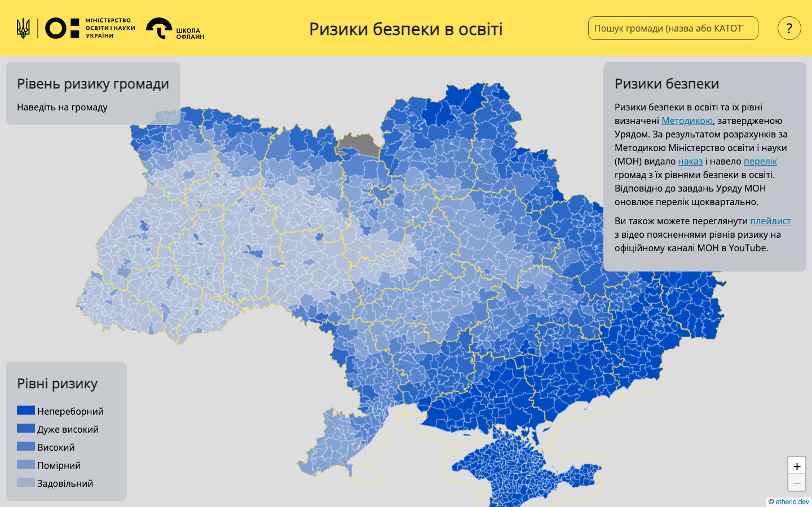
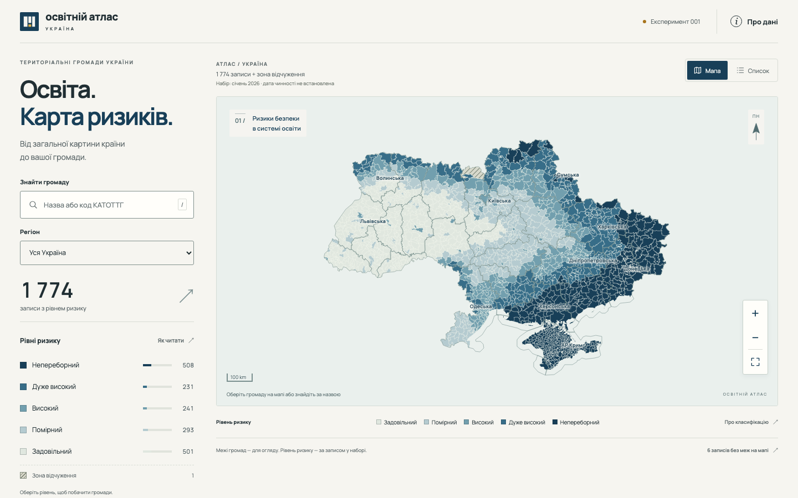
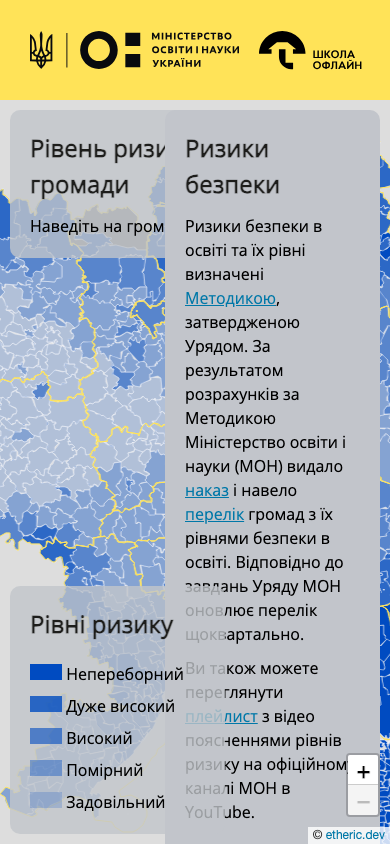
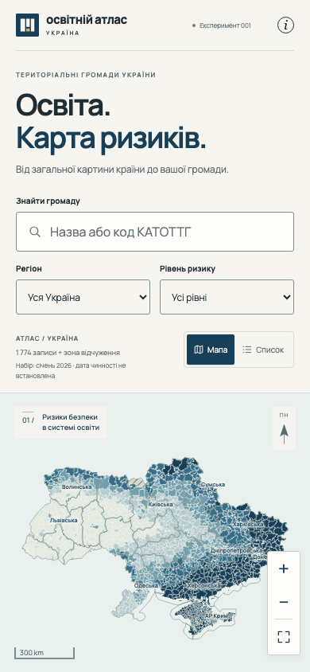

# Experiment 001 — B0

[Use the local candidate](http://127.0.0.1:8018/) · [Paired visual gallery](review.html) · [Issue #17](https://github.com/iachesis/ukraine-education-risk-map/issues/17)

The working result is **Освітній атлас**. Start with the openings below and the live product before reading the [creator's account](NOTES.md). This is the independently completed B0, frozen before external critique. It is ready for the experiment review gate.

From this checkout's root, the complete launch command is:

```sh
python3 -m http.server 8018 --bind 127.0.0.1
```

No application build, package installation, account or API key is needed. The original baseline is independently running locally on port 8017. These loopback previews are local review surfaces, not hosted deployments.

## Paired visual evidence

Unedited Chromium viewport captures, DPR 1, default motion. Select an image for its original pixels. Phone capture uses a 390 × 844 viewport with touch/mobile emulation; it is not a physical-phone photograph.

| A · baseline · 1440 × 900 | B0 · candidate · 1440 × 900 |
| --- | --- |
| [](evidence/baseline-desktop.png) | [](evidence/candidate-desktop.png) |

| A · baseline · 390 × 844 | B0 · candidate · 390 × 844 |
| --- | --- |
| [](evidence/baseline-mobile.png) | [](evidence/candidate-mobile.png) |

[The gallery](review.html) also pairs the same search and shows selection, comparison, regional list, long Ukrainian names and special geography. Additional unedited evidence includes [missing geometry](evidence/candidate-desktop-without-geometry.png), [empty results](evidence/candidate-desktop-empty.png), [320 px touch](evidence/candidate-touch-320.png), [200% text](evidence/candidate-text-200-detail.png), [data failure](evidence/candidate-data-failure.png) and [map failure](evidence/candidate-map-failure.png).

Continuous replayable traces: [candidate desktop](evidence/candidate-desktop-trace.zip), [candidate phone](evidence/candidate-mobile-trace.zip), [baseline desktop](evidence/baseline-desktop-trace.zip), [baseline phone](evidence/baseline-mobile-trace.zip). Candidate journeys open the atlas, find Харківська, select by keyboard, inspect the record, compare with Бродівська, open sources, explore a long name, an unmapped Crimea record and Chornobyl, then use a regional list and empty/reset state. Mobile also taps map controls. Traces contain the local application only, without source-code capture or private browsing context.

After the optional local tooling install below, replay without an external upload:

```sh
cd working/experiment-001
node node_modules/playwright/cli.js show-trace evidence/candidate-desktop-trace.zip --host 127.0.0.1 --port 8019
```

## Exact identity and workspace

| Identity | Value |
| --- | --- |
| Pinned A | `8e24e53dffcc77caf6b2e23a7b96b370b5948529` |
| Live main observed separately | `8e24e53dffcc77caf6b2e23a7b96b370b5948529`; no advance at discovery or publication audit |
| Frozen B0 code commit | `a2e4a1da0bf27afc839be50eb5a9d506e64aded9` |
| B0 tree | `da1b56afaf3a89b0a9021ff68fcbda6c5d66f916` |
| Freeze | 2026-09-08 13:23:17 UTC; before any external critique |
| Branch | `issue-17-astra-max-ui-001` — issue-governed naming for the requested isolated experiment |
| Build identity | Committed static source/assets; no runtime build |
| Workspace | Independent checkout from A. Original main checkout clean and untouched. B0 tracked code clean at freeze; evidence added separately. |

[freeze.json](evidence/freeze.json) records every runtime asset hash and the core verification source digest. Later evidence-only commits identify this B0 code commit and must leave those hashes unchanged. The exact review-storage head is linked from Issue #17; it is distinct from B0's code identity.

The [read-only publication audit](evidence/publication-audit.json) found legacy Pages sourced from `main` `/`, a Pages environment allowing only `main`, no repository hooks and no checked-in workflows. Dynamic CodeQL and Pages workflows are recorded. These observations establish branch/Draft-PR review storage as safe within the repository's observed configuration. No CI/deployment infrastructure was added. Main, CNAME, source data, inherited embedding configuration, hosting and account settings remain unchanged.

## Verification

| Check | Executed result |
| --- | --- |
| Complete census and pinned SHA-256 checks | **PASS** — all records, identifiers and classes reconciled |
| Deterministic geometry derivation | **PASS** — all 1,796 features, 2,264 rings and 400,977 source vertices checked |
| Domain and browser journeys | **55 PASS, 0 FAIL** — Chromium 153.0.8010.12, Firefox 155.0, WebKit 26.6 |
| Loading, failure, storage and inclusive interaction | **12 PASS, 0 FAIL** — Chromium; real 390/320 px touch events, keyboard, 200% text and reduced motion |
| axe-core 4.13.0 | **0 violations** on ten surfaces: desktop/phone overview, detail, list, about and comparison |
| Selected text/control contrast | **17 PASS** — CSS colours read directly; text threshold 4.5:1, controls/focus 3:1 |
| Normal-path console/network | **PASS** — no candidate runtime errors or third-party requests in the executed engine journeys |
| Performance | Final matched results below; full raw runs retained |

Evidence: [core verification](evidence/verification.json), [resilience](evidence/resilience.json), [contrast](evidence/contrast.json), [capture conditions](evidence/visuals.json), [baseline inspection](evidence/baseline-inspection.json). Each accessibility report retains incomplete checks: `aria-prohibited-attr` and `color-contrast` on atlas/list surfaces require human interpretation. Dialog scans have no incomplete checks. Zero automated violations is **not WCAG conformance**.

Manual creator inspection covered visible focus, skip/search navigation, arrow/Enter/Escape selection, modal focus confinement/return, long-name wrapping, scrolling, dark-map caption legibility, text labels alongside colour, hatched special geography, distinct unknown fixtures, and the same actions on phone layouts. Direct touch selections and map controls ran at both 390 and 320 px. The 200% text check doubles computed text/control font sizes, including newly rendered details; it is not OS or browser page zoom. The marker and class words preserve non-colour meaning; the list provides the keyboard equivalent to polygon selection.

Real records from every class were tested by both name and code. All 1,774 codes were checked programmatically. Ambiguous names, apostrophe variants, partial codes, the long Дубриницько-Малоберезнянська name, all six unmapped records, Chornobyl, URL restore/Back/Forward, selection/reset, empty results, three-item comparison limits/removal, pagination and exact scoped CSV content were exercised. Missing record/missing/null/invalid-class tests are separate intercepted-response fixtures, never modifications to the pinned snapshot. The [fixture screenshot](evidence/fixture-unknown-only.png) is test-only.

Executed commands, from `working/experiment-001` with the preview running:

```sh
python3 census.py --check
node derive.mjs --check
python3 contrast.py
node verify.mjs
node resilience.mjs
node capture.mjs
node performance.mjs
```

`node baseline.mjs` and `node inspect.mjs` ran during discovery/internal inspection. `git diff --check` and a byte-preserving diff of pinned inputs/CNAME/configuration passed. Exact package installs used local caches and `--ignore-scripts`; `npm audit` reported zero vulnerabilities. On a fresh checkout, install optional tooling locally:

```sh
cd working/experiment-001
npm ci --ignore-scripts --cache .cache
PLAYWRIGHT_BROWSERS_PATH=.browsers npx playwright install chromium firefox webkit
PLAYWRIGHT_BROWSERS_PATH=.browsers node verify.mjs
```

For performance reproduction, serve A separately on 8017 using `git archive` of the pinned commit into a fresh directory. `BASELINE_URL` and `CANDIDATE_URL` can override benchmark endpoints. Run the benchmark alone, with the same two static servers and no concurrent browser test runner. Earlier failed/intermediate checks and the superseded timing probe are retained under [development evidence](evidence/development/); they are not represented as B0 passes.

## Loading and interaction performance

Medians in milliseconds (A → B0); all cells have three successful repetitions. Full min/max ranges remain in the linked summary.

| Profile | Viewport | Cache | Map rendered | Search result useful | Different-code lookup |
| --- | --- | --- | ---: | ---: | ---: |
| local | desktop | cold | 405 → 189 | 705 → 204 | 298 → 8 |
| local | desktop | warm | 159 → 139 | 457 → 146 | 298 → 6 |
| local | mobile | cold | 504 → 190 | 800 → 193 | 381 → 7 |
| local | mobile | warm | 139 → 138 | 449 → 138 | 382 → 7 |
| constrained | desktop | cold | 20,088 → 3,875 | 20,443 → 2,562 | 390 → 32 |
| constrained | desktop | warm | 17,380 → 565 | 17,736 → 625 | 378 → 29 |
| constrained | mobile | cold | 20,075 → 3,858 | 20,425 → 2,566 | 628 → 32 |
| constrained | mobile | warm | 17,336 → 539 | 17,669 → 582 | 617 → 28 |

Constrained cold desktop map rendering falls from 20.09 s to 3.87 s (about 81%); a useful search result falls from 20.44 s to 2.56 s (about 87%). Search stays independent of geometry. No material regression was observed in this matched run; the local warm phone map difference is below 1 ms and should be treated as noise.

CDP-recorded encoded transfer is 9,534,206 → 1,613,212 bytes cold and 8,326,331 → 105 bytes warm, consistently in these runs. Warm transfer depends on the tested browser/server caching behavior; this is not an offline guarantee. Interaction timing includes the automated input action and polling overhead, and is not INP.

Conditions: Apple M4, 16 GiB RAM, macOS 26.6.2, Chromium 153.0.8010.12, Python 3.12.12 static servers on loopback, DPR 1. Three repetitions per version × viewport × cache × profile = 48 navigations. Cold uses a fresh context and cleared HTTP cache. Warm reloads that same context with HTTP caching and application storage retained. Constrained means 4 Mbps down, 1 Mbps up, 80 ms latency and 4× CPU slowdown. This emulates a connection on desktop hardware, not a physical phone; background OS load is uncontrolled.

Search readiness means a real query result is visible after input wiring. Map timing means all community geometry is attached plus two animation frames, with actual usability checked separately. The baseline phone remains **unusable for the tested pointer selection** despite its rendered-map timestamp: panels intercept results, its layout expands to 1,172 CSS px, and selection does not persist as useful touch detail. The candidate's search remains usable during a 3-second geometry delay; metadata and geometry have independent retry paths.

Baseline storage quota warnings and missing Chornobyl search/record warnings are retained. Candidate normal-path logs are clean; expected 503/aborted-request errors appear only in explicit failure tests. Raw timings, per-run logs and transferred bytes are in [performance.json](evidence/performance.json); medians/ranges are in [performance-summary.json](evidence/performance-summary.json). The initial same-result interaction timer is superseded: final timing changes from Харківська to Бродівська by exact code.

## Data reconciliation

| Scope | Count |
| --- | ---: |
| Risk records in pinned snapshot | 1,774 |
| ADM3 geometry features | 1,769 |
| Risk records matched to geometry | 1,768 |
| Risk records without geometry | 6 |
| Geometry without risk record | 1 — Chornobyl exclusion zone |
| Explorer entries including special zone | 1,775 |
| Duplicate keys, geometry IDs or KATOTTG codes | 0 |
| Missing/invalid actual snapshot classes | 0 |
| Duplicate full-name groups | 64, covering 147 records |

| Recorded class | All risk records | Mapped risk records |
| --- | ---: | ---: |
| Непереборний | 508 | 502 |
| Дуже високий | 231 | 231 |
| Високий | 241 | 241 |
| Помірний | 293 | 293 |
| Задовільний | 501 | 501 |

All six unmapped records are in the snapshot's Crimea region: Андріївська, Верхньосадівська, Інкерманська, Качинська, Орлинівська and Тернівська. Their valid `Непереборний` classification is preserved. No replacement boundaries or positions are invented. Full IDs/codes, region totals, ADM1 ID mismatches, hashes and provenance limitations are in [census.json](evidence/census.json) and [the complete join CSV](evidence/joined-records.csv).

The compressed geography asset is 894,402 bytes versus 8,908,158 bytes of raw ADM1/ADM3. No feature or ring was removed. [Derivation evidence](evidence/derivation.json) documents exact parity and the quantization bound. The original three data files remain unchanged. The January 2026 repository date is **not an official effective date**; the latter and upstream geometry age/authority remain unknown.

## Separate design judgment

Creator self-assessment uses Issue #17's anchors, with 4 = excellent and 5 = exceptional. It is not an independent score or human research.

| Dimension | Creator judgment | Observed basis and remaining limit |
| --- | ---: | --- |
| Immediate impact and legibility | 4 | Recognizable national geography, clear type hierarchy, quiet civic tone. Dense small-area geometry and fine labels still reward zooming. |
| Coherent visual/cartographic composition | 4 | One paper/ink system, ordered class scale, gold selection, complete national view and consistent detail surfaces. |
| Interaction quality and continuity | 4 | Fast independent search, persistent records, shareable state, Back/Forward, equivalent list, comparison and exact export. Mobile moves between detail and map by scrolling. |
| Fine execution across states | 4 | Long/ambiguous names, failures, sources, missing geometry, comparison and empty states were rendered, used and refined. |
| Trust and comprehension | 4 | Scope reconciles; special/unknown cases are distinct; age and authority limits appear in the experience. Institutional validation remains absent. |
| Mobile and inclusive design | 4 | Deliberate phone structure, 320 px touch, keyboard equivalents, enlarged text, reduced motion and mobile accessibility scans. Physical devices and assistive technology remain unrun. |

**Integrity/usability floor: PASS within the executed scope. Exceptional-design gate: not established.** This is a strong creator-assessed candidate; the stricter charter threshold requires exceptional impact and interaction, and a human first-look has not occurred. The Founder/orchestrator should record the unprimed ten-second response separately from subsequent task exploration. No B1 has been commissioned or performed.

## Ownership, effort and candid limits

Observed local owner: `gpt-6-astra`, reasoning effort `max`, Codex Desktop/CLI `0.153.4`, provider `openai`. This comes from session metadata, not inference from a display label. Browser work used the Codex in-app browser and isolated Playwright. Relevant skills: `software-search-first` and `openai-docs`; repository/user/desktop instructions and Issue #17 governed the work. No supporting agents, auxiliary models, image generation or separate paid API workload were used.

Session start was 11:58:17 UTC; B0 froze at 13:23:17 UTC, about 85 minutes later. Documentation and final matched benchmarking followed the freeze. [session.json](evidence/session.json) records observable runtime cumulative token counters, including cached context; they are not unique prompt size, billed credits or cost. Exact task dollars/credits and independent compute measurements are unavailable. Human intervention before B0 was the charter and commission only. [The iteration record](NOTES.md#internal-iterations-and-interventions) distinguishes internal fixes from external guidance.

Remaining limits: unknown official effective date and upstream geometry provenance; consolidated legal-source versions could not be checked because the source returned 403; six real records have no geometry; no school-level data, trend or numeric risk score exists here. Modern browser APIs are required. Actual Safari/Firefox products on physical phones, VoiceOver/screen readers, browser/OS zoom, exhaustive WCAG conformance and production deployment/embedding acceptance are **UNRUN**. Current colour classes remain dense on a national phone map, so search, zoom and the equivalent list are essential. Human wow is unconfirmed.

Stop at experiment review. The Draft PR is storage; production adoption remains a separate Founder decision.
